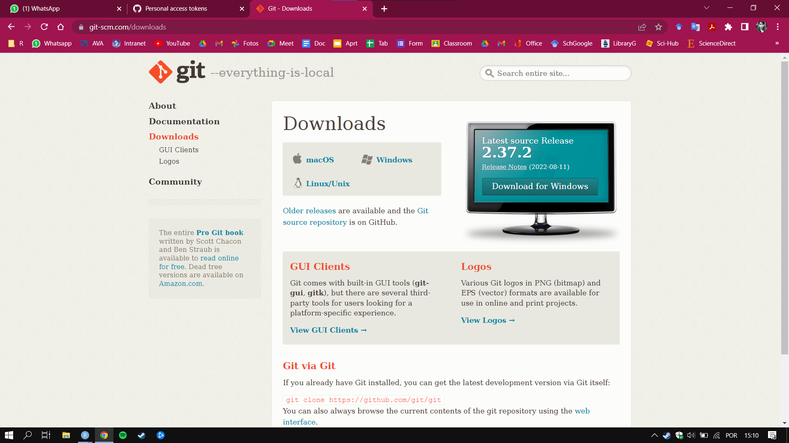
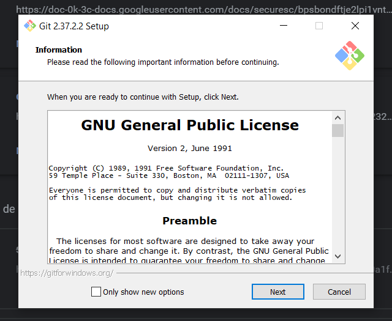
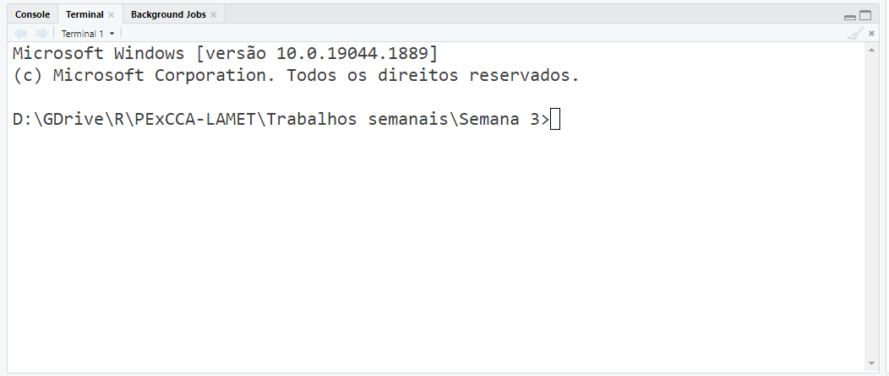
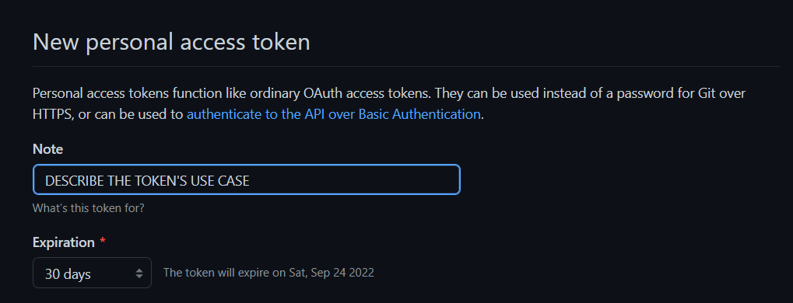
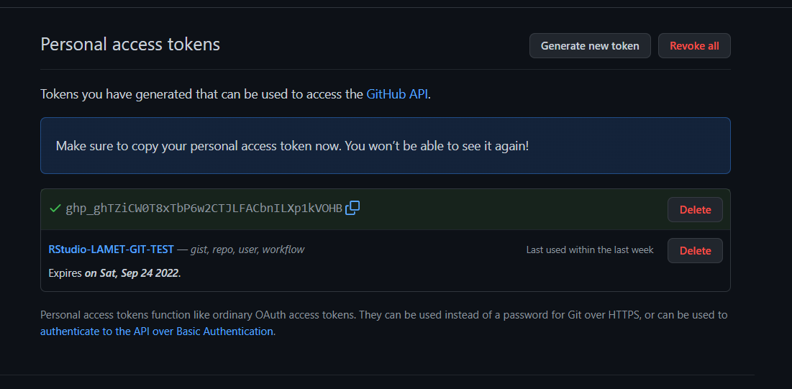
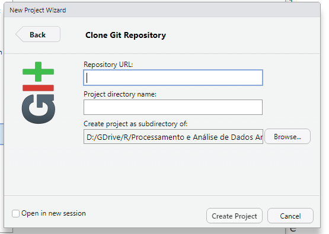
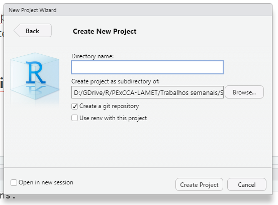
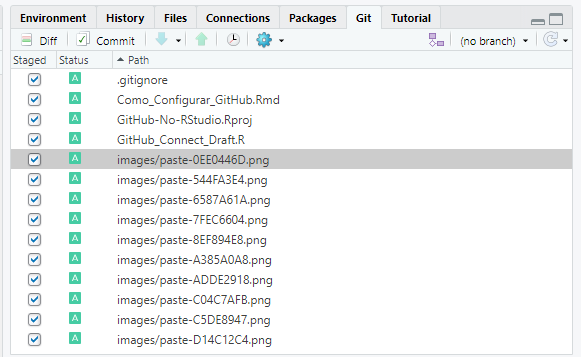
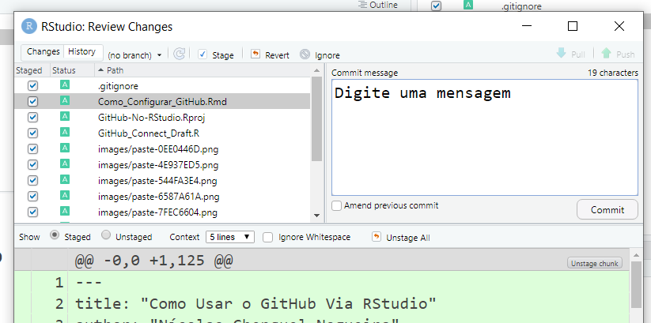

# Introdução

Então, esse vai ser um documento informal, mais como uma forma de registrar meu aprendizado e compartilhar com vocês da equipe. Passei umas 3 horas lutando contra o Git, GitHub e o RStudio para entender isso. Sinceramente, as pessoas que programa essas coisas foram muito espertas e muito burras ao mesmo tempo. O processo todo não é muito claro, e existem alguns muitos tutoriais na internet que tem um pouco da coisa mas não tem tudo.

Vou tentar então juntar tudo que consegui aqui em um documento só.

### Primeiro passo

Instale o R.\
Instale o RStudio.\
Instale o Git.

Instalar o R e o RStudio é bem simples, e bem, acredito que já esteja tudo certo por ai. Você pode encontrar o Git neste [link](https://git-scm.com/downloads).



Basta fazer o Download e seguir com o processo de instalação. Não entendi o que metade das configurações de instalação significavam, mas eu só fui clicando prosseguir e a coisa toda funcionou.



### Segundo passo

Crie uma conta no GitHub.

### Terceiro passo: diga "oi" para o Git.

Acesse um terminal de comando do Windows, pode ser no RStudio mesmo, na aba ao lado do Console.

Digite suas credenciais cadastradas no GitHub utilizando estes comandos:

`git config --global user.name '<SeuNomeDeUsuario>'`

`git config --global user.email '<SeuEmailDoGitHub>'`



### Quarto passo: o pacote do R "usethis"

Primeiramente, instale o pacote.

`install.packages("usethis")`

Depois, configure suas credenciais no pacote, as mesas que definiu ali em cima.

```{r}
# usethis::use_git_config(
#  user.name = "<SeuNomeDeUsuario GitHub>", 
#  user.email = "<SeuEmailDoGitHub>")
```

Em seguida, precisamos de um token de autenticação do github cadastrado no RStudio. O comando abaixo abre uma aba no navegador.

```{r}
# usethis::create_github_token()
```

Faça login no GitHub.\
Dê um nome para identificar o Token, algo como "RStudio".\
Defina um tempo de validade do Token.\
Copie o token. Após fechar esta janela, você não será mais capaz de ver o token.





Em seguida, cole o token utilizando a seguinte função:

```{r}
# gitcreds::gitcreds_set()
```

Reinicie o R.

Cheque se deu tudo certo:

```{r}
usethis::git_sitrep()
# > Git config (global)
#> ● Name: 'SEU NOME DEVE APARECER AQUI'
#> ● Email: 'SEU EMAIL DEVE APARECER AQUI'
#> GitHub
#> ● Default GitHub host: 'https://github.com'
#> ● Personal access token for 'https://github.com': '<discovered>'
#> ● GitHub user: 'SEU NOME DE USUÁRIO(A) DEVE APARECER AQUI'
#> ● Token scopes: 'gist, repo, user, workflow'
#> ● Email(s): 'SEU EMAIL DEVE APARECER AQUI'
```

Parabéns, você já pode utilizar o GitHub integrado ao RStudio.

### Clonar um repositório do GitHub

Imagino que em nosso dia-a-dia, o mais importante é clonar os repositórios e upar as modificações.

Primeiramente, acesse **Tools** \> **Global Options** \> **Git/SVN** e certifique-se que o RStudio sabe onde está o **git.exe**


Em seguida, crie um novo projeto em **File** \> **New Project** \> **Version Control** \> **Git** e insira o URL do repositório nestre primeiro campo.\
O URL do diretório é o URL lá do GitHub mesmo. ( ex. <https://github.com/PExCCA-LAMET-UENF/Test-Git-R> )



Selecione no ultimo campo em que pasta de seu computador o repositório será clonado. Pronto, já tem os arquivos do diretório em seu computador!

### Criando um novo repositório no GitHub via RStudio

Crie um R Project novo. Ao definir o nome do diretório, marque a caixa "Create a git repository".



Prossiga com seu projeto. Para submeter ao GitHub, você deve primeiro acessar a aba Git no canto superior direito, selecionar os arquivos que deseja upar, e clicar em **Commit.**



Digite uma mensagem de resumo para seu Commit.



### Submeter um diretório para o GitHub

Agora complica um pouquinho...
